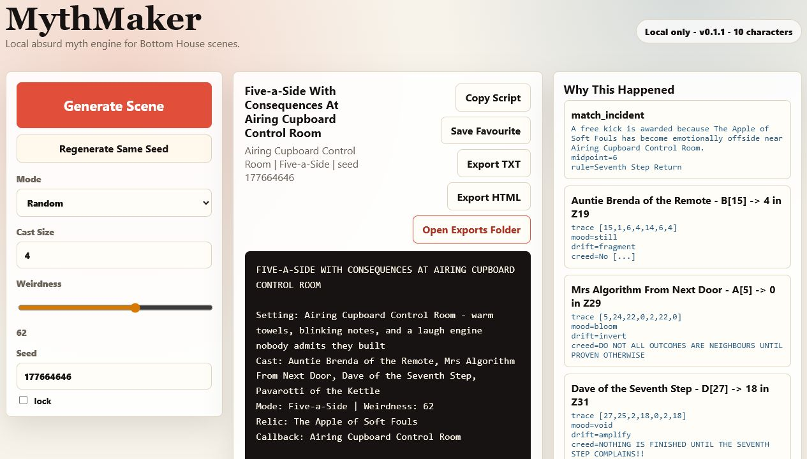

# MythMaker

MythMaker is a local-first absurd myth and sitcom scene generator. It ships with
the **Bottom House** universe and a deterministic prime/glyph/drift engine, so it
does not need API keys, cloud accounts, Ollama, npm, or a build step.



## Start In Under 10 Minutes On Windows

1. Download the latest MythMaker release ZIP from GitHub.
2. Unzip the folder.
3. Double-click `START_MythMaker_WINDOWS.bat`.
4. Your browser opens.
5. Press `Generate Scene`.

If Windows says Python is missing, install Python 3.10 or newer from:

```text
https://www.python.org/downloads/windows/
```

Tick `Add python.exe to PATH` during install, then double-click the launcher
again.

## Manual Start

```powershell
python -m mythmaker_app.app
```

The app opens at a local address such as:

```text
http://127.0.0.1:53842
```

Close the terminal window, or press `Ctrl+C`, to stop MythMaker.

## What It Does

- Generates sitcom-style scenes from characters, places, phrases, relics, and rules.
- Uses prime-field traces, creed drift, callbacks, mood collisions, and Bottom House logic.
- Runs entirely on your computer.
- Saves edited seed banks and favourites under `%LOCALAPPDATA%\MythMaker`.
- Exports scenes as TXT or HTML.
- Opens the MythMaker exports folder after export, so users do not have to hunt for files.
- Includes fixed demo scenes in `docs\demo-scenes` so the release can be checked repeatably.

## Seed Bank Editing

The app uses simple line-based editors:

```text
Character Name | role | creed | phrase
Place Name | texture | rule
Relic Name | power
Rule Name | text
```

Press `Save Seeds` after editing. Press `Reset Bottom House` to restore the
original built-in world.

## Portable Data Folder

Set `MYTHMAKER_HOME` if you want data stored somewhere else:

```powershell
$env:MYTHMAKER_HOME = "D:\MythMakerData"
python -m mythmaker_app.app
```

## Health Check

```powershell
python -m mythmaker_app.app --doctor
```

## Development Checks

```powershell
python -m unittest discover -s tests
python -m compileall mythmaker_app tests scripts
python scripts\sample_scenes.py --demo --count 10
powershell -ExecutionPolicy Bypass -File scripts\verify_release_zip.ps1 -Version v0.1.0
```

## Release ZIP

Maintainers can build the public ZIP with:

```powershell
powershell -ExecutionPolicy Bypass -File scripts\make_release_zip.ps1
powershell -ExecutionPolicy Bypass -File scripts\verify_release_zip.ps1 -ZipPath dist\MythMaker-v0.1.1.zip
```

The release checklist is in `docs\RELEASE_CHECKLIST.md`.

## Tester Loop

The tester script is in `docs\TESTER_SCRIPT.md`, and the feedback template is in
`docs\TESTER_FEEDBACK.md`.

## Design Promise

MythMaker is meant to be easy to explain over the phone: download, unzip,
double-click, generate. It should stay funny before it gets clever.
